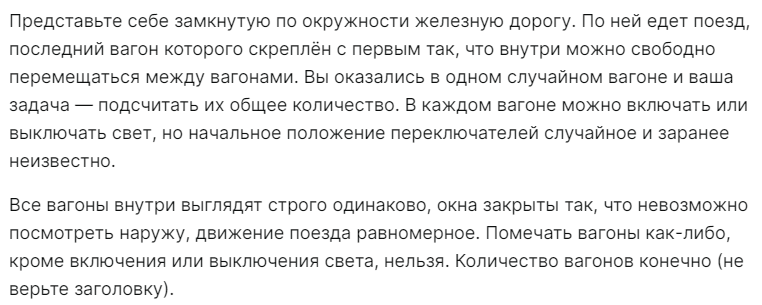

# Домашние задания
## Занятие 30 (12.12.2022)
- [ ] 
## Занятие 29 (09.12.2022)
- [ ] Реши задачу про сумму чисел, полученных стиранием нулей справа у чисел от 1 до N. Реализуй две функции, одну наивную, а другую - с подходом, обсуждённым на занятии, проверь их на небольших числах, а затем сравни время выполнения на числе 1234567890 (можно не замерять время в коде, оценить "на глаз")
- [ ] [Лексикографически отсортированные строки](https://leetcode.com/problems/count-sorted-vowel-strings/) (сори, я не помню точно, удалось ли её доделать)
- [ ] [Найти значение логического выражения](https://leetcode.com/problems/evaluate-boolean-binary-tree/)
- [ ] [Поиск в двоичном дереве поиска (binary search tree, BST) ](https://leetcode.com/problems/search-in-a-binary-search-tree/)
- [ ] [pre-order обход N-арного дерева](https://leetcode.com/problems/n-ary-tree-preorder-traversal/)
- [ ] [Максимальная глубина N-арного дерева](https://leetcode.com/problems/maximum-depth-of-n-ary-tree/)
## Занятие 28 (05.12.2022)
- [ ] **Задание на ресёрч.** Нужно ответить на вопросы (сначала подумать без привлечения внешних источников, затем наоборот, заиспользовав навыки поиска и анализа информации в Интернете):
  - [ ] **Что такое** граф? Чем этот термин отличается от термина "дерево"?
  - [ ] **Какие бывают графы?** Не нужен полный набор терминов; только те, которые покажутся тебе важными/чем-то заинтересуют (в список ответов на этот вопрос можно включить сколь угодно сложные термины, но для каждого пункта нужно найти и понять определение)
  - [ ] **Что такое BFS и DFS?** Приведи по два примера из твоей жизни, когда ты их используешь (вероятно, неосознанно)
  - [ ] Взгляни на [задачу о Кёнигсбергских мостах](https://ru.wikipedia.org/wiki/%D0%97%D0%B0%D0%B4%D0%B0%D1%87%D0%B0_%D0%BE_%D1%81%D0%B5%D0%BC%D0%B8_%D0%BA%D1%91%D0%BD%D0%B8%D0%B3%D1%81%D0%B1%D0%B5%D1%80%D0%B3%D1%81%D0%BA%D0%B8%D1%85_%D0%BC%D0%BE%D1%81%D1%82%D0%B0%D1%85) и попробуй ответить самостоятельно, как её решить? Затем проверь себя (или посмотри решение) там же
## Занятие 27 (02.12.2022)
- [x] Посмотреть задачи из [прошлогоднего муниципального этапа Всероса](https://vos.olimpiada.ru/upload/files/Arhive_tasks/2021-22/mun/iikt/tasks-iikt-9-11-mun-msk-21-22.pdf), по меньшей мере понять формулировку, попробовать решить
## Занятие 26 (29.11.2022)
- [ ] Заглянуть на [e-maxx.ru/algo](https://e-maxx.ru/algo/), вдруг что приглянётся и заинтересует :)
- [x] [Так вот что значит название CIties: Skylines](https://leetcode.com/problems/max-increase-to-keep-city-skyline/description/) (эта задача должна была быть в списке задач на жадные алгоритмы, но мне не удалось понять ни по своему решению, ни по официальному предложенному, каким образом здесь нужна жадина)

Задачи на жадные алгоритмы (требуется не только решить задачи, но и понять, в чём состоит "жадность" используемого алгоритма):
- [x] [Сбор монет](https://leetcode.com/problems/maximum-number-of-coins-you-can-get/)
- [x] [Наполнение чашек](https://leetcode.com/problems/minimum-amount-of-time-to-fill-cups/description/)
## Занятие 25 (25.11.2022)
Иии... я ничего не задал ┗( T﹏T )┛
## Занятие 24 (21.11.2022)
- [x] [Longest uncommon subsequence I](https://leetcode.com/problems/longest-uncommon-subsequence-i/)
- [x] [Find center of a star graph](https://leetcode.com/problems/find-center-of-star-graph/)
- [x] [Find if path exists in a graph](https://leetcode.com/problems/find-if-path-exists-in-graph/)
## Занятие 23 (14.11.2022)
- [ ] [Зигзаг-преобразование](https://leetcode.com/problems/zigzag-conversion/) 
- [x] [Найти максимальную общую подпоследовательность двух строк](https://leetcode.com/problems/longest-common-subsequence/)
## Занятие 22 (11.11.2022)
- [x] [Является ли строка подпоследовательностью другой строки](https://leetcode.com/problems/is-subsequence/)
## Занятие 21 (07.11.2022)
- [ ] [Подсчёт числа единиц](https://leetcode.com/problems/counting-bits/) во всех числах от 0 до n
## Занятие 20 (04.11.2022)
Я ничего не прислал ಥ_ಥ
## Занятие 19 (31.10.2022)
- [x] Как объяснить постороннему человеку, **почему** алгоритм преобразования числа из десятичной системы счисления в двоичную (или любую другую) именно такой?
- [x] Треугольник Паскаля [раз](https://leetcode.com/problems/pascals-triangle/) 
- [x] Треугольник Паскаля [два](https://leetcode.com/problems/pascals-triangle-ii/)

## Занятие 18 (28.10.2022)
- [x] Составь календарь олимпиад (можно гугл-календарь или яндекс-календарь), кинь мне ссылку
- [x] Почему для получения представления отрицательного двоичного числа в дополнительном коде (этот код позволяет складывать и вычитать двоичные числа в столбик) нужно не только инвертировать (побитово) его модуль, но и прибавить к результату единицу? Откуда берётся такая асимметрия между положительными и отрицательными числами?
## Занятие 17 (24.10.2022)
- [ ] Задача про бесконечный поезд

## Занятие 16 (21.10.2022)
- [x] [Сумма значений на пути от корня до листа](https://leetcode.com/problems/path-sum/)
## Занятие 15 (17.10.2022)
- [x] [Проверка, является ли дерево сбалансированным](https://leetcode.com/problems/balanced-binary-tree/)
- [ ] Найти способ решить [задачу про цикл в связном списке](https://leetcode.com/problems/linked-list-cycle/) ~~через рекурсию или найти убедительные доводы, почему это невозможно~~, используя константное количество памяти (множество, которое пополняется ссылками на элементы списка, не подойдёт - у него потребление памяти, как несложно догадаться, растёт как минимум линейно с ростом числа звеньев)
## Занятие 14 (14.10.2022)
- [x] [Подъём по лестнице ](https://leetcode.com/problems/climbing-stairs/)
- [x] [Проверка двух деревьев на равенство](https://leetcode.com/problems/same-tree/)
## Занятие 13 (10.10.2022)
Дебажили всякое
## Занятие 12 (07.10.2022)
- [x] Зарегистрируйся на [Yandex Cup (направление "Бэкенд")](https://yandex.ru/cup/backend/)
- [x] [Покупаем - продаём](https://leetcode.com/problems/best-time-to-buy-and-sell-stock/) 
  - [x] ответить на вопрос в Miro
  - [x] доделать задачу так, чтобы она влезла в time limit
## Занятие 11 (03.10.2022)
- [x] Задача про [in-order обход дерева](https://leetcode.com/problems/binary-tree-inorder-traversal/)
## Занятие 10 (30.09.2022)
- [x] [ABABA из ЕГЭ](https://inf-ege.sdamgia.ru/problem?id=27694)
  - [x] Добавить тесты
  - [x] Отдебажить с их помощью программу
- [x] [Сумма элементов пар, не кратная 5](https://inf-ege.sdamgia.ru/problem?id=27890)
## Занятие 9 (26.09.2022)
- [x] [Задачи на логику](lessons/week_05/homework_09_10.md) (из "Как же называется эта книга?"):
  - [x] № 27
  - [x] № 32
  - [x] № 36
## Занятие 8 (23.09.2022)
Я налажал и ничего не прислал ⊙﹏⊙∥
## Занятие 7 (19.09.2022)
- [x] [Связные списки](https://leetcode.com/problems/add-two-numbers/)
    - [x] Попробовать воспроизвести решение с занятия или вывести своё (без конвертации списка в число)
## Занятие 6 (16.09.2022)
Провал в памяти и в записях (´。＿。｀)
## Занятие 5 (12.09.2022)
- [x] [Эффективный Two Sum](https://leetcode.com/problems/two-sum/)
- [x] [Роман ту интеджер](https://leetcode.com/problems/roman-to-integer/)
## Занятие 4 (09.09.2022)
- [x] [Архив пользовательских файлов](https://inf-ege.sdamgia.ru/problem?id=27886)
- [ ] [Максимальная сумма непрерывной последовательности, в которой число нечётных чисел кратно 10](https://inf-ege.sdamgia.ru/problem?id=39256)
- [x] [Программа, подсчитывающая число различных слов в введённой строке](lessons/week_02/homework_04.md)
## Занятие 3 (05.09.2022)
Обсуждали функции (⊙_⊙)？
## Занятие 2 (02.09.2022)
Комбинаторика?.. (￣▽￣)"
## Занятие 1 (29.08.2022)
- [x] [Можно ли было забить?](lessons/week_01/homework_01.md)
- [x] [Матрица](lessons/week_01/homework_01.md)
- [x] [Всюду делители](lessons/week_01/homework_01.md)