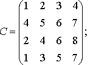

# Задание с занятия 01

## 1. Можно ли было забить?
Мы оптимизировали на занятии программу, снижали её алгоритмическую сложность. Но стоила ли игра свеч?

Предположим, программу "Версии 1" нужно запустить для диапазона `[180 001 , 180 020]`. Сколько итераций внутреннего цикла будет выполнено на протяжении всей программы?

Предположим, что процессор может за секунду выполнить 10^9 операций; успеет ли программа выполниться? А если 10^6?

## 2. Матрица
**Квадратной матрицей порядка n** в математике называется "сетка" из n столбцов и n строк, в узлах которой стоят числа.[^1]

Например, матрица порядка 4:



Предположим, я написал программу, которая позволяет задать матрицу произвольного размера, затем заполнить её и к каждому числу матрицы прибавляет заданное с клавиатуры значение; какова будет, скорее всего, алгоритмическая сложность моего алгоритма изменения матрицы в зависимости от параметра матрицы n?

А если в моей программе на вход принимается k матриц, к каждой из которых можно прибавить своё число?

[^1]: Сетку, конечно, никто не рисует, просто ставят большие скобки слева и справа от этой "таблицы" чисел.

## 3. Всюду делители
Напиши программу, позволяющую по [разложению числа на простые множители](https://ru.wikipedia.org/wiki/%D0%A4%D0%B0%D0%BA%D1%82%D0%BE%D1%80%D0%B8%D0%B7%D0%B0%D1%86%D0%B8%D1%8F_%D1%86%D0%B5%D0%BB%D1%8B%D1%85_%D1%87%D0%B8%D1%81%D0%B5%D0%BB) найти число всех его делителей (включая единицу и само это число). **Сами делители выводить не надо.**

Программа принимает следующие входные данные:
- на первой строке - число n, означающее, сколько различных простых делителей имеет число;
- далее на n строках - пары натуральных чисел вида `простой_множитель степень_множителя`, где степень множителя - это максимальная степень, в которой данный простой множитель входит в разложение исходного числа.

Программа должна вывести одно число - количество всех делителей числа, разложение которого на множители было подано на вход.

Пример работы программы:

```
Input:
3
2 2
3 1
7 1

Output:
12
```