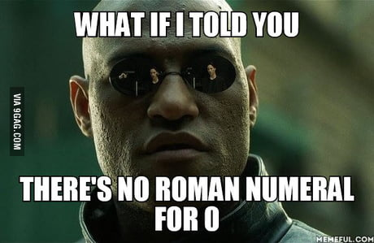

# Задание с занятия 5

## 1. Эффективный Two Sum
На занятии ты реализовал алгоритм решения [задачи Two Sum](https://leetcode.com/problems/two-sum/), имеющий квадратичную сложность по времени.

Попробуй улучшить этот результат! (и дай оценку сложности полученного алгоритма)

## 2. Роман ту интеджер (a.k.a. конвертация римских чисел)


https://leetcode.com/problems/roman-to-integer/

Римские числа записываются с помощью семи различных символов (цифр):  I, V, X, L, C, D и M.

```
Символ   Значение
I               1
V               5
X              10
L              50
C             100
D             500
M            1000
```

Например, 2 записывается как II, 12 записывается как XII, 27 - как XXVII.

Римские цифры обычно записываются слева направо в порядке убывания их значения. Однако, например, 4 записывается не как IIII, а как IV. Цифра с меньшим "весом", следующая перед цифрой с бОльшим "весом", должна "вычитаться" из неё. Например, число 9 записывается как IX, что значит "из десяти нужно вычесть один".

Есть шесть случаев, когда используется вычитание цифр вместо их прибавления:

- I можно поставить перед V (5) и X (10), чтобы получить 4 или 9;
- X можно поставить перед L (50) и C (100), чтобы получить 40 и 90;
- C можно поставить перед D (500) и M (1000), чтобы получить 400 и 900.

Переведи переданное в качестве аргумента функции число из римской записи (т.е. из строки) в целое число.
