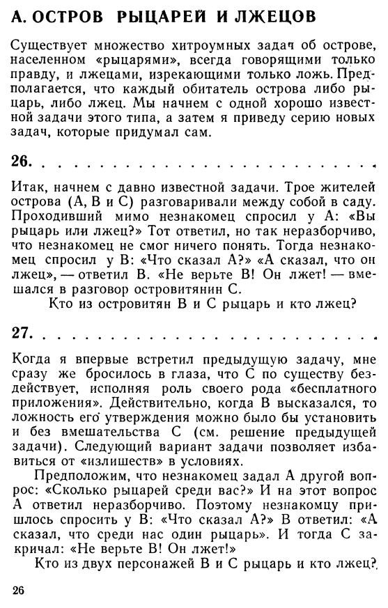
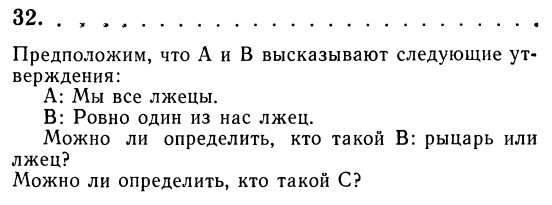
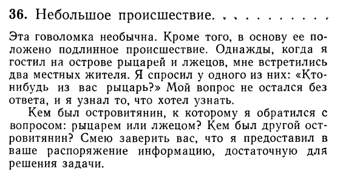

# Домашнее задание с занятий 9 и 10
## 0. Чеклист
- [ ] 1. Задания с прошлых занятий:
  - [ ] сумма последовательности
  - [ ] связные списки
- [x] 2. Задачи на логику:
  - [x] 2.1
  - [x] 2.2
  - [x] 2.3
- [ ] Задания из ЕГЭ на программирование:
  - [ ] Первое
  - [ ] И второе
## 1. Доделать прошлые задания
А именно [задачу из ЕГЭ](https://inf-ege.sdamgia.ru/problem?id=39256) про наибольшую сумму последовательности и [задачу про связные списки](https://leetcode.com/problems/add-two-numbers/).
## 2. Элементарно, Ватсон!
Реши несколько заданий на логику из **книги Рэймонда Смаллиана "Как же называется эта книга?"** (горячо её рекомендую).

Как и всегда в математике и задачах на логику в особенности, **правильным решением** считается не то, в котором получен правильный _ответ_, а то, в котором _обоснование_ ответа логически верное. 😊

Решения этих задач, пожалуйста, распиши текстом (рукописным или печатным, как тебе удобнее, хотя я сам предпочитаю писать от руки - поговаривают, это помогает обучению).

### 2.1 Задача №27 (привожу страницу целиком для контекста).

### 2.2 Задача №32 (я не знаю, зачем указываю номер задачи, который и так есть на скрине)

### 2.3 Задача №36

## 3. Задачи из ЕГЭ с занятия
Собственно, остаётся только аккуратно их реализовать.

### 3. 1 [Раз](https://inf-ege.sdamgia.ru/problem?id=27694)

### 3.2 [Два](https://inf-ege.sdamgia.ru/problem?id=27890)