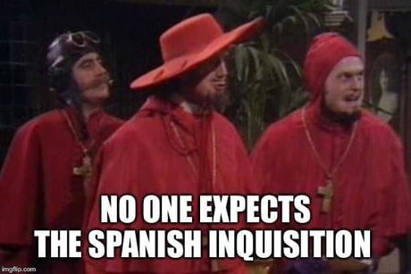

# Занятие 12 (07.10.2022)
## 1. Обсуждаем домашку

## 2. Возможный драматический поворот!


_К слову, важная часть лора Python_
##  3. План Б
### 3.1 enumerate()
### 3.2 Добьём дерево
### 3.3 Покупаем - продаём
https://leetcode.com/problems/best-time-to-buy-and-sell-stock/

> Вам дан массив цен, где `prices[i]` - цена акции на `i`-ый день
> 
> Вы хотите максимизировать свою прибыль, выбрав один день, чтобы закупиться акциями, и другой день, чтобы их продать.
>
> Найдите максимально возможную прибыль от такой транзакции (за одну акцию). Если получить прибыль невозможно, верните `0`.
>
> Пример 1:
```
Ввод: prices = [7,1,5,3,6,4]
Вывод: 5
Объяснение: Купить на дне 1 (цена равна 1) и продать на дне 4
(цена равна 6), прибыль равна 6 - 1 = 5.
Обратите внимание, что купить акции на дне 1 и продать на дне 0 нельзя,
поскольку перед перепродажей акций нужно их купить.
```
> Пример 2: 
```
Ввод: prices = [7,6,4,3,1]
Вывод: 0
Объяснение: В этом случае выгоднее всего не проводить транзакцию вообще,
максимальная прибыль равна нулю.
```
